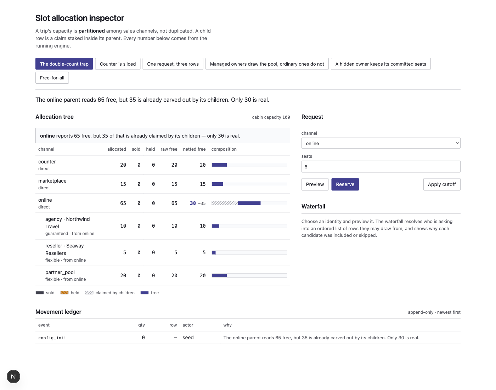
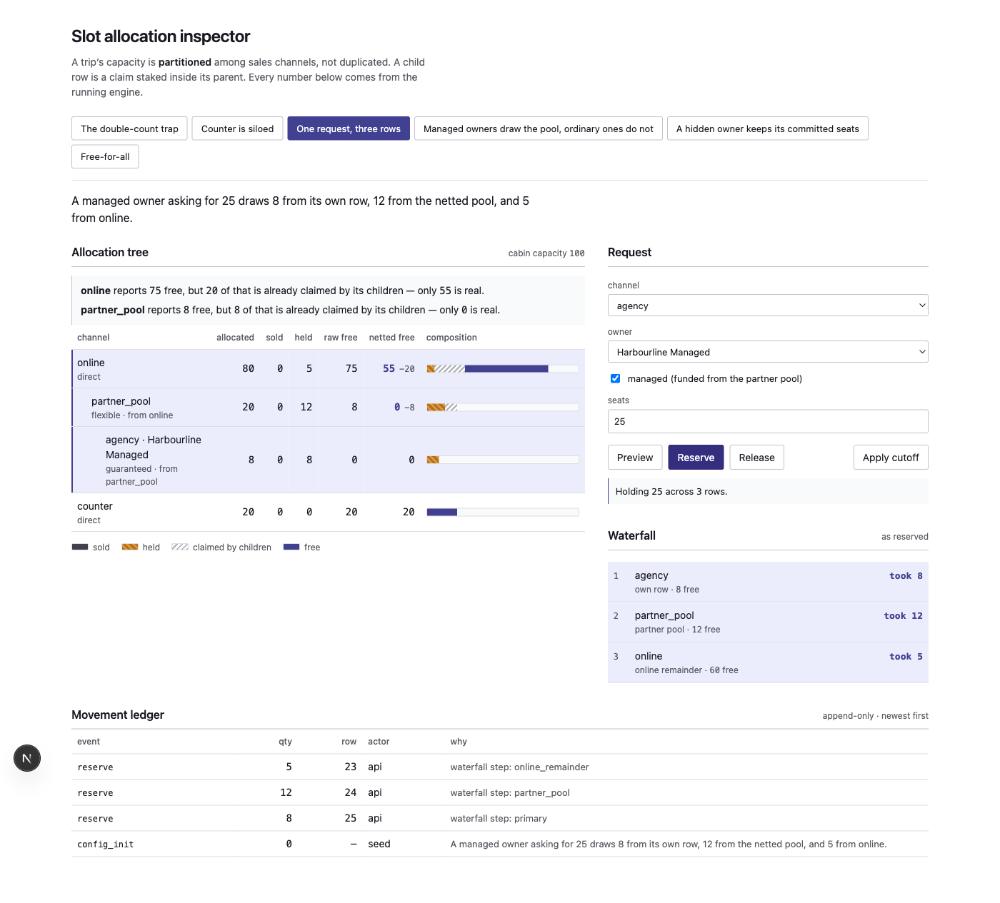

# Slot Allocation

[](https://github.com/Eloe321/slot-allocation-model/actions/workflows/verify.yml)

A capacity-allocation engine for a ferry booking platform: a trip's seats are
partitioned among sales channels — walk-up counter, online, marketplace,
agencies, resellers — with one hard physical ceiling that must never be breached,
under concurrent load, across a booking lifecycle of holds, sales, refunds and
cutoff.

**I build booking and capacity-allocation systems that prevent overselling across direct, partner, and reseller channels.** This repository includes a manager workflow, a guided booking demo, role-specific views, an inventory report, and a signed CRM webhook outbox. See the [case study](docs/CASE_STUDY.md), [API guide](docs/API.md), and [walkthrough outline](docs/WALKTHROUGH.md).

This is a rebuild. The original is production software I wrote inside a
proprietary multi-tenant platform (~20k lines) and cannot publish. This
reproduces the part that is actually interesting, anonymised, runnable, and
argued for.

**This README is the source of truth.** You should be able to understand the
model, the mathematics, the algorithm and the trade-offs without opening a
source file.



---

## Contents

1. [The problem](#1-the-problem)
2. [Quickstart](#2-quickstart)
3. [The model](#3-the-model)
4. [The capacity mathematics](#4-the-capacity-mathematics)
5. [The waterfall](#5-the-waterfall)
6. [Lifecycle: holds, links, cutoff](#6-lifecycle-holds-links-cutoff)
7. [Concurrency](#7-concurrency)
8. [The ledger](#8-the-ledger)
9. [Testing](#9-testing)
10. [Decisions](#10-decisions)
11. [What I deliberately left out](#11-what-i-deliberately-left-out)
12. [Scenario catalogue](#12-scenario-catalogue)

---

## 1. The problem

A ferry sails with 100 seats in a cabin. The operator does not sell 100 seats
into one pool. It promises 20 to the counter, 15 to a marketplace partner, 10 to
a travel agency under contract, and keeps the rest for direct online sales.

The naive model is a list of buckets that each know their own capacity. It is
wrong, and it is wrong in a way that does not show up until it costs someone a
seat they paid for.

> **The allocation tree is a capacity _partition_, not a list of independent
> capacities. A child row is not extra seats — it is a claim staked inside its
> parent.**

Here is the whole problem in one picture:

```
cabin capacity: 100
├── counter        direct       20
├── marketplace    direct       15
└── online         direct       65   ← parent
    ├── agency#7   guaranteed   10     funded from online
    ├── reseller#3 flexible      5     funded from online
    └── partner_pool flexible   20     funded from online   ← itself a parent
        └── agency#9 guaranteed  8       funded from partner_pool
```

The `online` row says `allocated = 65`. Nothing is sold. So it has 65 seats
free — except 35 of those are already promised to its children. **Only 30 are
real.**

Sum the rows naively and you get 118 seats on a 100-seat ship. Offer the parent's
65 to a customer while an agency simultaneously books its 10, and two people are
sitting in the same seat when the ferry leaves.

Everything below exists to prevent that.

---

## 2. Quickstart

Requires Docker, Node 24.10.0 (see `.nvmrc`), and pnpm 10.20.0.

```bash
pnpm bootstrap            # install, start PostgreSQL, migrate, seed the scenarios
pnpm dev                  # API on :4001, inspector on :3000
```

Then open <http://localhost:3000> (if 3000 is busy the app prints the port it
chose). Select the operator, administrator, or partner demo role. Six seeded
scenarios each demonstrate one rule. “Reset current scenario” rebuilds the
selected seed without affecting other configurations.

```bash
pnpm verify               # starts PostgreSQL, provisions the test DB, migrates,
                          # lints, typechecks, tests, and builds both apps
```

Port 55432 rather than 5432 so this cannot collide with a PostgreSQL you already
run. The API accepts any `localhost` origin, so a busy port 3000 is not fatal.

Tests run against a **separate database** (`slot_allocation_test`, provisioned
explicitly by `pnpm bootstrap` and `pnpm verify`) so they cannot wipe the
scenarios in the demo database. The database is created through PostgreSQL,
without a bind-mounted init file; provisioning and migrations can be rerun.
GitHub Actions runs the same `pnpm verify` command on pushes and pull requests.
See [CONTRIBUTING.md](CONTRIBUTING.md) for the individual checks.

The role chooser is deliberately public and uses no real customer data. Custom
demo proposals and their approved sailings expire after 24 hours, with a cap of
100 proposals and 500 active sessions. To send
confirmed bookings to a CRM, configure `CRM_WEBHOOK_URL` and
`CRM_WEBHOOK_SECRET` on the API; see the [signature and retry contract](docs/API.md#crm-booking-confirmation-webhook).

A [disposable Docker deployment](docs/DEPLOYMENT.md) is included. A public URL
and recorded walkthrough will be added after a host and domain are selected.

---

## 3. The model

A **voyage** is a dated sailing. Each voyage × **cabin** has one allocation
config: the tree of buckets bookings actually consume.

### Channels

| Channel | Role | Owned |
|---|---|---|
| `counter` | Walk-up inventory. Direct, and deliberately siloed. | — |
| `online` | Direct online sales **and** the parent pool children are carved from. | — |
| `marketplace` | Explicit direct marketplace partition. | — |
| `partner_pool` | Shared pool that *managed* owners draw from. Itself a child of `online`. | — |
| `agency` | Dedicated child allocation. | `owner_id` |
| `reseller` | Dedicated child allocation. | `owner_id` |

### Row attributes

- **`allocation_type`** — `direct` (a top-level partition of the cabin),
  `flexible` (a child, reclaimed at cutoff), `guaranteed` (a child, protected
  through cutoff).
- **`funding_source`** — `online` or `partner_pool`. *Which parent this child was
  carved out of.* This single field is what makes the structure a tree rather
  than a list.
- `allocated_slots`, `sold_slots`, `held_slots`.
- `owner_is_hidden` — the owner is deleted or masked.

### Two orthogonal identity concepts

These are easy to conflate and conflating them produces wrong code:

- **Managed** is a property of the **requester**: its entitlement is funded from
  `partner_pool` rather than `online`. It decides which row matches as its
  primary, *and* whether it may draw the pool at all.
- **`owner_is_hidden`** is a property of a **row**: its owner is gone. It grants
  no pool access and only drives the collapse rule below.

A managed requester need not have a hidden row, and a hidden row need not belong
to a managed requester.

---

## 4. The capacity mathematics

### Row level

```
raw_available(r) = max(0, allocated − sold − held)
```

### Netting a parent

```
online_children  = Σ allocated  where type ∈ {flexible, guaranteed}
                                  and funding ≠ partner_pool
online_committed = online.sold + online.held
online_effective = max(online_committed, online.allocated − online_children)
online_available = max(0, online_effective − online_committed)
```

and identically for the partner pool against its own funded children.

Applied to the tree in §1: `65 − 35 = 30`. That is the number the system offers.

**The `max(online_committed, …)` clamp is load-bearing.** Without it, an
administrator enlarging a child beyond what the parent has already sold drives
effective allocation negative, and the row starts reporting nonsense instead of
zero.

### The invariants

1. Per row: `sold + held ≤ allocated`
2. `Σ direct allocations ≤ cabin capacity`
3. `Σ online-funded children + online.sold + online.held ≤ online.allocated`
4. `Σ partner-funded children + pool.sold + pool.held ≤ pool.allocated`
5. Every funded child requires its parent row to exist
6. At most one `online` direct row, and one `partner_pool` row, per config
7. At most one row per `(channel, owner_id)` — *not* per funding source
8. Golden: `physical sold + open holds ≤ physical capacity`, always

Invariants 3 and 4 **include the parent's own committed seats**, and that is not
cosmetic. The weaker form — children against the parent's allocation alone —
admits a parent that has sold 60 of 100 while a child holds 50: the child's seats
are free by its own row, the parent's are committed, and together they exceed the
partition. I shipped the weaker form first and it oversold by 10.

Invariant 7 keys on `(channel, owner_id)` and deliberately **not** on funding
source. An owner is managed or it isn't — a property of the owner, not of a row —
and `selectPrimary` filters on funding accordingly. Let one owner hold both an
online-funded and a partner-funded row and exactly one is matchable by any
identity, while **both** are netted out of their parents: the other row's seats
are carved away and reachable by nobody. I shipped the looser key first, and it
stranded 10 seats of 100. See [ADR-0013](docs/decisions/0013-one-row-per-owner.md).

Invariant 8 must **never** be checked by summing every row, because parents and
children overlap by design. A naive sum reports a violation on a perfectly valid
tree.

---

## 5. The waterfall

An identity resolves to an **ordered list of rows it may draw from**.

| Requester | Candidate order |
|---|---|
| `counter` | own row only — **never** spills |
| `agency`/`reseller`, ordinary | own row → netted `online` remainder |
| `agency`/`reseller`, managed | own row → `partner_pool` → netted `online` remainder |
| `marketplace` | own row → netted `online` remainder (never the pool) |
| `online` direct | the netted `online` row only |
| free-for-all | a config that is one unowned `online` direct row serves everyone |

A single request may **split across several candidates**, taking what each can
give ([ADR-0004](docs/decisions/0004-splitting-requests.md)). Requesting 25 as a
managed owner:



```
1. agency · Harbourline Managed   own row           took 8
2. partner_pool                   partner pool      took 12
3. online                         online remainder  took 5
```

Each split becomes its own hold, booking link and ledger entry.

### Two rules worth stating

**An unresolved owner must hard-fail.** A null owner matches the *unowned*
online row, so letting an ownerless agency request through would silently drain
the operator's pool under that agency's name — a data-integrity bug that looks
exactly like ordinary traffic in the logs. The engine's `RequesterIdentity` type
makes an ownerless owner *unrepresentable*; the HTTP boundary is where untrusted
input either becomes a valid identity or is rejected with a 400.

**A hidden owner's row collapses to its committed seats.** It loses its free
entitlement but keeps `sold + held` carved out of the parent — returning those
would let already-sold seats sell twice. Crucially the collapse applies to
**every** requester, including the masked owner itself. Exempting it makes the
netted tree differ per requester, and the two views together double-count. That
bug was in this repository and is worth reading about:
[ADR-0011](docs/decisions/0011-identity-free-netting.md).

---

## 6. Lifecycle: holds, links, cutoff

### Holds

```
POST /configs/:id/reservations   → token, TTL 600s, held += qty across splits
POST /reservations/:token/confirm → held −=, sold +=, links written
POST /reservations/:token/release → seats returned to their source rows
sweeper (10s)                     → expires lapsed tokens
```

States: `open` | `confirmed` | `released` | `expired`. Confirmation is idempotent
only when every row under the token is already confirmed; a released or expired
token must never increase sales.

### Booking links

Confirmation writes one `booking_slot_links` row per split. **The link — not the
booking's declared channel — determines where capacity returns on cancellation.**
This is the only correct answer when the waterfall drew from three rows, and it
stays correct when the tree changes afterwards
([ADR-0005](docs/decisions/0005-durable-links.md)).

### Cutoff

At the booking cutoff, unsold capacity consolidates onto the counter. `flexible`
children and direct online/marketplace rows give up their free portion;
`guaranteed` children keep theirs.

The subtlety is that this must **preserve the partition**:

```
movable(r) = allocated − own_children − sold − held      (netted, not raw)

when a child releases X:  child.allocated  −= X
                          parent.allocated −= X
                          counter          += X
```

Release a parent's *raw* free portion and you hand away seats its children hold.
Credit the counter for a child's release without shrinking its parent and you
count the same headroom twice. I made both mistakes; together they produced 135
reachable seats on a 100-seat cabin.

Done correctly, direct allocations still sum to cabin capacity and each parent
lands exactly on its ceiling — so **the database constraints stay armed through
cutoff** rather than standing down for it
([ADR-0012](docs/decisions/0012-armed-through-cutoff.md)).

---

## 7. Concurrency

Fifty people want the last ten seats.

The reservation path locks the config row first — serializing writers on one
config — then locks its allocation rows `ORDER BY id`, so every transaction
acquires locks in the same order and cannot deadlock
([ADR-0003](docs/decisions/0003-pessimistic-locking.md)):

```
BEGIN
  SELECT … FROM allocation_configs WHERE id = $1 FOR UPDATE
  SELECT … FROM channel_allocations WHERE config_id = $1 ORDER BY id FOR UPDATE OF a
  → hand plain rows to the engine
  ← receive splits
  apply deltas; insert holds; append ledger
COMMIT
```

`FOR UPDATE OF a` rather than bare `FOR UPDATE` because the query joins `owners`,
and locking owner rows would block unrelated configs that share an agency.

### Correctness in three independent layers

Each catches what the one above cannot.

| Layer | What it is | What it catches |
|---|---|---|
| **Engine** | Pure invariant checks, property-tested | Logic errors, exhaustively |
| **Transaction** | Row locks, ordered acquisition | Races, and produces good errors |
| **Database** | `CHECK`s, deferred triggers, partial unique indexes | Everything the code above forgot |

All nine engine violation codes have a SQL counterpart. A "defence in depth"
where one layer is a subset of another is one layer wearing a hat
([ADR-0006](docs/decisions/0006-deferred-constraints.md)).

### The proof

```
✓ oversell under concurrency > grants exactly the available seats when 50 requests race for 10
✓ oversell under concurrency > keeps the ledger consistent with the counters under contention
✓ oversell under concurrency > does not oversell when concurrent requests split across the tree

 Test Files  1 passed (1)
      Tests  3 passed (3)
```

Exactly ten succeed; forty receive a typed shortfall carrying
`requested / available / shortfall` rather than a crash; the ledger sums to the
seats actually held; no row violates its invariant. Run against real PostgreSQL,
not a mock. Full output: [`docs/evidence/concurrency-run.txt`](docs/evidence/concurrency-run.txt).

---

## 8. The ledger

`slot_movements` is append-only and written in the same transaction as the change
it describes, so it can never disagree with the counters it explains. Every
capacity movement records its rows, quantity, actor, reason and reservation
token.

The ledger answers **why** capacity changed. The reconciliation queries answer
**whether** the counters agree with the links and open holds. Those are different
questions and both matter during an incident.

---

## 9. Testing

The suite covers the pure engine and real PostgreSQL, including configuration
approval, role boundaries, reporting, and webhook delivery.

- **Unit** — the engine's rules, in isolation.
- **Property-based** — fast-check over generated trees. Two complementary
  properties, and the pair matters more than either alone: one drains every
  identity and asserts total commitment never **exceeds** the partition (no
  oversell); the other asserts draining **reaches** it exactly (no capacity
  carved out and then addressable by nobody).
- **Integration** — real Postgres, including the constraint triggers themselves.
- **Concurrency** — §7.

One lesson worth passing on. An earlier property asserted a **per-identity**
bound, which is trivially satisfiable and structurally *incapable* of detecting
double-counting between identities. It passed 1,300 runs while the engine
oversold. The replacement was validated by deliberately reintroducing the bug and
confirming it failed, shrinking to 21 seats on a 20-seat cabin.

**A property that has never been seen to fail has not been shown to test
anything.**

---

## 10. Decisions

Each record states the options, the decision, and what the rejected option would
have been better at.

| | Decision |
|---|---|
| [0001](docs/decisions/0001-pure-engine.md) | Keep the allocation logic in a dependency-free package |
| [0002](docs/decisions/0002-netting-at-read-time.md) | Compute netted availability at read time |
| [0003](docs/decisions/0003-pessimistic-locking.md) | Pessimistic row locks in a deterministic order |
| [0004](docs/decisions/0004-splitting-requests.md) | Let one request draw from several rows |
| [0005](docs/decisions/0005-durable-links.md) | Record which row each sold seat came from |
| [0006](docs/decisions/0006-deferred-constraints.md) | Enforce the invariants in the database too |
| [0007](docs/decisions/0007-no-cargo-track.md) | Leave out the cargo / lane-metre track |
| [0008](docs/decisions/0008-no-templates.md) | Leave out templates, versions and snapshots |
| [0009](docs/decisions/0009-drizzle-and-raw-sql.md) | Drizzle for schema, hand-written SQL where it matters |
| [0010](docs/decisions/0010-ttl-sweeper.md) | Return expired holds with a sweeper |
| [0011](docs/decisions/0011-identity-free-netting.md) | **Netting must not depend on who is asking** |
| [0012](docs/decisions/0012-armed-through-cutoff.md) | **Cutoff preserves the partition, so constraints stay armed** |
| [0013](docs/decisions/0013-one-row-per-owner.md) | **One row per owner per channel, regardless of funding** |

0011, 0012 and 0013 document real bugs found in this code, with their
reproductions. They are the three most worth reading.

---

## 11. What I deliberately left out

Scope cuts stated confidently are judgement; unexplained absences are gaps. Each
has a record saying what including it would have demonstrated.

| Cut | Why |
|---|---|
| **Cargo / lane metres** | The passenger path with `numeric(10,3)` instead of `int`. Doubles the code, adds no idea. The honest way to show the generalization is to make the engine generic over the unit, not to copy it. ([0007](docs/decisions/0007-no-cargo-track.md)) |
| **Templates, versions, snapshots** | Version pinning is a good idea, but it is CRUD plus a foreign key sitting *upstream* of the allocation problem. ([0008](docs/decisions/0008-no-templates.md)) |
| **Multi-tenancy, identity federation** | Deployment topology of the original system, not part of the allocation problem. |
| **Payments and customer accounts** | The demo has selectable roles and an allocation-level booking lifecycle, without personal data or financial transactions. Production authentication is separate work. |

Also honest about the limits of the proofs. The oversell and reachability
properties together pin the drained total to exactly the allocated partition,
but they run over a fixed five-row generator shape — it produces no `reseller`
rows, and only two owners. A stranding mode that needs a shape outside that
family would not be generated. The properties are a floor, not a ceiling.

---

## 12. Scenario catalogue

Each seeded scenario lands on exactly one rule. Selecting one in the inspector
rebuilds it from scratch.

| Scenario | The rule it demonstrates |
|---|---|
| **The double-count trap** | The online parent reads 65 free; 35 is claimed by children; only 30 is real. |
| **Counter is siloed** | The counter never spills. A counter request fails while online has seats. |
| **One request, three rows** | A managed owner asking for 25 draws 8 / 12 / 5 across own row, pool and online. |
| **Managed owners draw the pool** | Two identical-looking agencies resolve differently, on funding source alone. |
| **A hidden owner keeps its committed seats** | The masked agency loses its free seats to the parent but keeps the 4 it sold. |
| **Free-for-all** | One unowned online row, and every channel draws from it. |

---

## Layout

```
packages/engine/     575 lines, zero I/O — netting, waterfall, planning, invariants
apps/api/            NestJS: locking shell, holds, approvals, cutoff, ledger, report, webhook outbox, HTTP
  drizzle/migrations hand-written SQL: constraints, deferred triggers, indexes
apps/web/            Next.js manager, operator, and partner demo
docs/decisions/      13 ADRs
docs/evidence/       real test output quoted above
```
