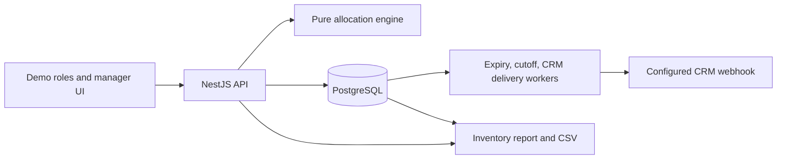

# Ferry capacity without overselling

> I build booking and capacity-allocation systems that prevent overselling across direct, partner, and reseller channels.

**Live demo:** [slot-allocation-model.pages.dev](https://slot-allocation-model.pages.dev)

## Problem

A ferry cabin has one physical seat count, while the operator promises portions of those seats to counter sales, direct online sales, agencies, and resellers. A parent pool can show more raw free seats than can actually be sold because children have claims inside it. In the seeded example, the online parent shows **65 raw free** but only **30 sellable** after its child allocations are netted out.

## Constraints and approach

The booking path must preserve one physical ceiling under concurrent requests and through temporary holds, confirmations, releases, expiry, and cutoff. I separated the capacity rules into a pure engine, then put a PostgreSQL transaction and deterministic row locks around each booking. Database constraints enforce the same ceilings if a future caller bypasses the service. Every counter change writes an append-only movement in the same transaction.

The manager workflow previews invariants before submission; an administrator approves a proposal before it becomes bookable. The operator can inspect a waterfall, run competing requests, and read an inventory report. A partner session is filtered to its own allocations and movements. Confirmed bookings queue a signed CRM webhook with a stable idempotency key and an audited retry trail.

## Outcome

The [live demo](https://slot-allocation-model.pages.dev) lets a prospective
client move from capacity design to an approved sailing, then observe a hold,
confirmation, release, cutoff, ledger entry, and report without real customer
data or payments. It turns the allocation model into a focused example of an
operator workflow that prevents overselling across direct and partner channels.

## Evidence

- The root `pnpm verify` command provisions a separate test database, applies migrations, runs lint, type checks, engine and PostgreSQL integration tests, and builds both apps. GitHub Actions runs the same command on pushes and pull requests.
- The concurrency test sends competing reservations against one allocation and checks that the physical ceiling holds. Property tests check both oversell prevention and capacity reachability.
- The CRM integration test uses a real local HTTP receiver to verify HMAC signing, a failed attempt, retry, stable idempotency key, and delivery audit.
- The report test checks physical versus sellable capacity, held and sold seats, releases, and refused oversell attempts, including a funded child that must not be counted twice.

## Screens

| Administrator | Operator | Partner |
|---|---|---|
| [Plan and approve allocations](images/admin-plan.png) | [Inspect bookings and ledger](images/operator-booking.png) | [Own inventory only](images/partner-inventory.png) |

## Trade-offs and limits

The demo deliberately uses selectable roles, no personal data, and no real payments. It demonstrates role boundaries, not production authentication. The CRM receiver is configured by environment variables; no customer endpoint is bundled into the public repository. The report focuses on live operator decisions and cumulative movement counts rather than general analytics. The ferry story is the only vertical shown.

## Starter client offer

**Capacity and booking workflow audit:** I map your current sales channels, identify oversell risks, and deliver a fixed-scope allocation and integration plan. The output is a capacity map, exception list, and a prioritized implementation plan that can be reviewed before any platform rebuild.
